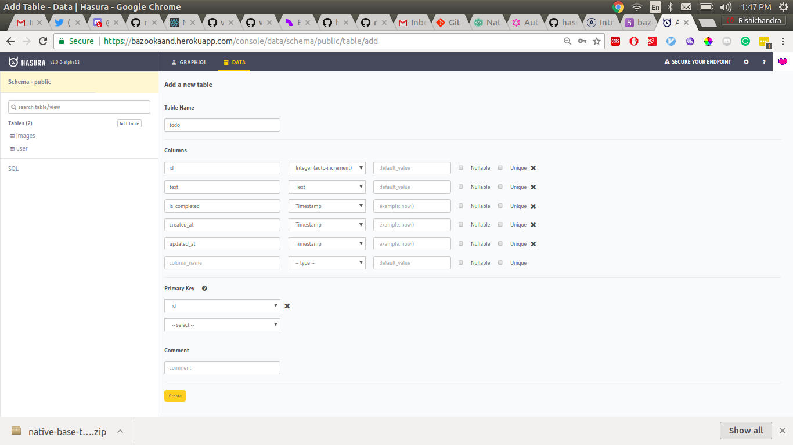

# React Native Todo App with NativeBase, Hasura GraphQL Engine and Apollo

## Introduction

This is a simple React Native todo app that uses [NativeBase](https://nativebase.io/) for styling, [Hasura GraphQL Engine](https://hasura.io) for the backend and [Apollo](https://www.apollographql.com/docs/react/) for GraphQL integration and caching.

### Apollo

[Apollo Client](https://www.apollographql.com/docs/react/) is the best way to use GraphQL to build client applications. The client is designed to help you quickly build a UI that fetches data with GraphQL, and can be used with any JavaScript front-end. In this app, we will use the [react-apollo](https://github.com/apollographql/react-apollo) for integrating Apollo client with React Native.

### Hasura

[Hasura GraphQL Engine](https://hasura.io) is a blazing-fast GraphQL server that gives you instant, realtime GraphQL APIs over Postgres, with webhook triggers on database events for asynchronous business logic. Hasura helps you build GraphQL apps backed by Postgres or incrementally move to GraphQL for existing applications using Postgres.

### NativeBase

[NativeBase](https://nativebase.io/) is a free and open source UI component library for React Native to build native mobile apps for iOS and Android platforms. NativeBase provides all the styled components that one needs for any application with the components being totally open to custom styling.


## Running the app

1. Clone the repo and install the node modules

    ```
    git clone git@github.com:wawhal/native-base-todo-hasura
    cd native-base-todo-hasura
    npm install
    ```

2. Get Hasura GraphQL Engine running by simply clicking this button. Once it is deployed, copy the URL (it must be of the form: `https://<your-app>.herokuapp.com`) and paste it in `constants.js` in root directory.

   [](https://heroku.com/deploy?template=https://github.com/hasura/graphql-engine-heroku)

3. Go to the GraphQL Engine console by going to its URL. Click on the `Data` tab on the top and create a table called todo.

   

4. Finally, run the app with [Expo](expo.io)

    ```
    npm install -g expo-cli
    npm start
    ```

## Support

For queries and bugs, here are some important links

- [Apollo Slack](https://www.apollographql.com/slack/)
- [Apollo Github Issues](https://github.com/apollographql/apollo-client/)
- [Hasura Discord](https://discord.gg/vBPpJkS)
- [Hasura Github Issues](https://github.com/hasura/graphql-engine/issues)
- [NativeBase Slack](http://slack.nativebase.io/)
- [NativeBase Github Issues](https://github.com/GeekyAnts/NativeBase/issues)
